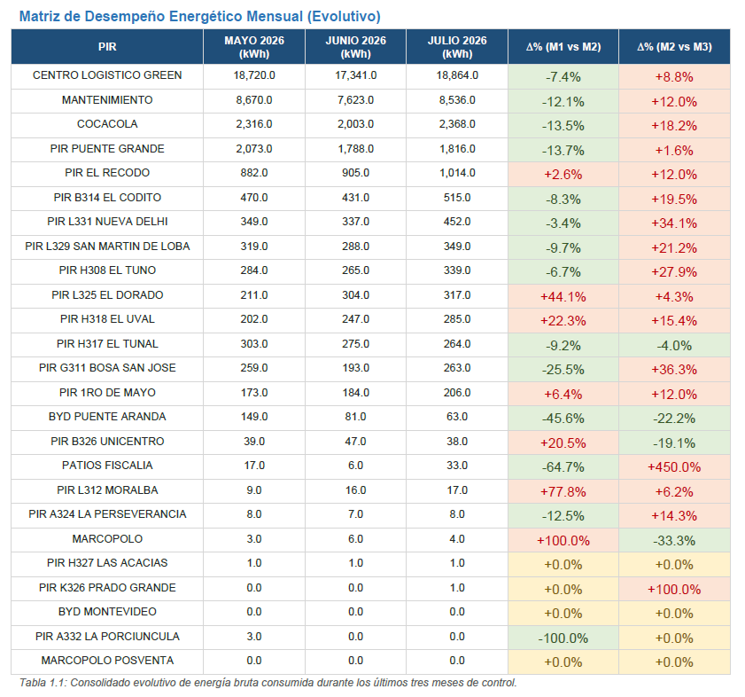
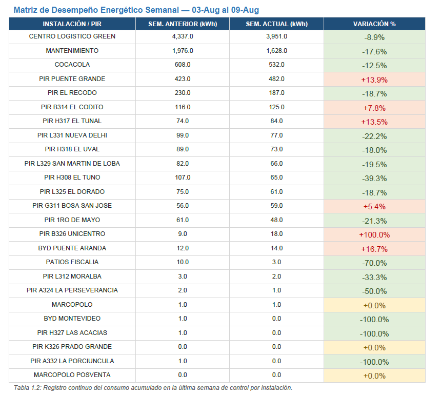
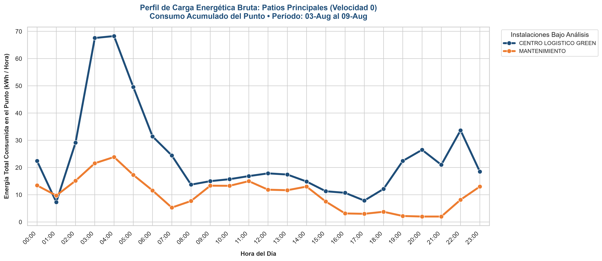
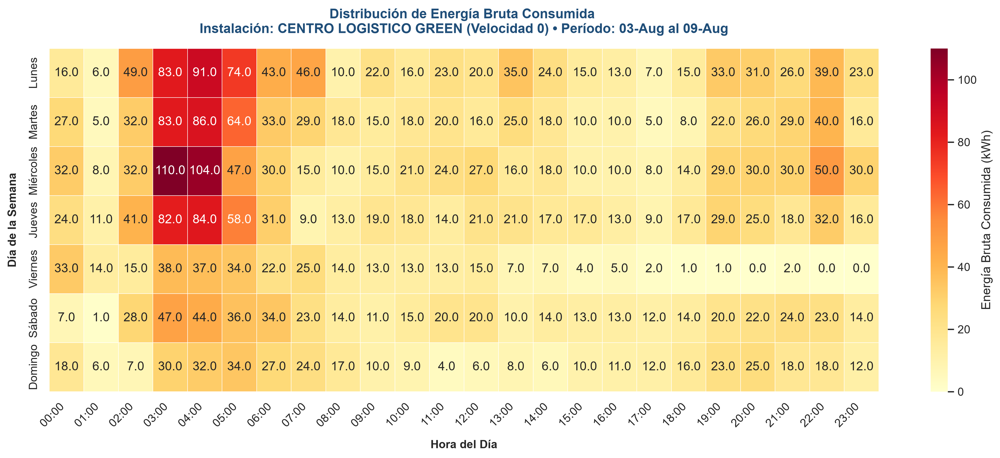
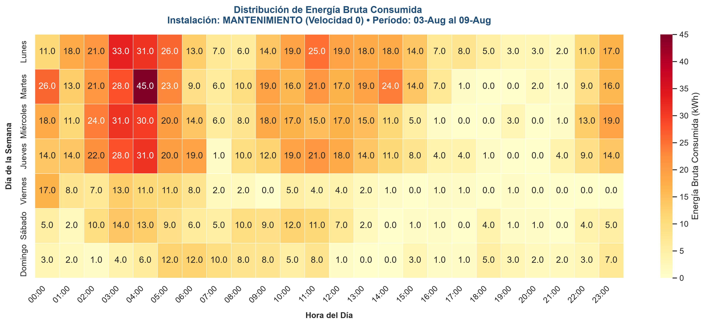
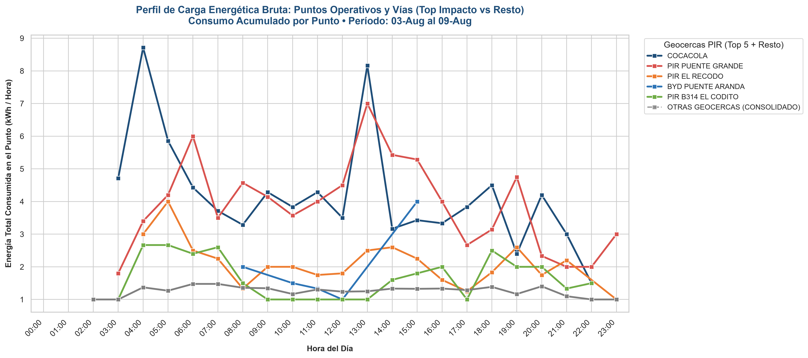
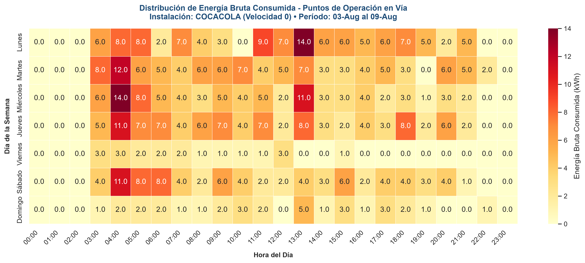

# ⚡ Informe de Consumo en Reposo (Velocidad 0) – Geocercas PIR | ISO 50001

Pipeline automatizado de **ETL + generación de informe PDF** para el diagnóstico de desperdicio energético en condición de reposo (velocidad 0) dentro de las geocercas PIR de la flota de autobuses eléctricos, alineado con la norma **ISO 50001**.

---

## 🎯 Objetivo del Proyecto

Establecer un sistema de seguimiento continuo del **consumo energético en reposo** (Velocidad 0) en los Puntos de Interés en Ruta (PIR) y patios, con el fin de:

- Identificar desperdicio energético durante tiempos de inactividad
- Detectar desviaciones mensuales y semanales por geocerca
- Localizar franjas horarias críticas de consumo ineficiente
- Generar automáticamente un informe ejecutivo en PDF
- Soportar la mejora continua del Sistema de Gestión de la Energía (ISO 50001)

El sistema procesa datos de telemetría, aplica filtros de velocidad y geocercas, construye matrices de desempeño y perfiles de carga, y entrega un informe profesional listo para distribución.

---

## 📊 Notebook / Script Principal

El núcleo del proyecto es el script de ETL e informe:

👉 **[ETL-Informe_Consumo_Reposo.py](./ETL-Informe_Consumo_Reposo.py)**

---

## 📈 Resultados Principales del Informe

### 1. Matriz de Desempeño Energético Mensual (Evolutivo)

Comparativo de consumo en reposo de los últimos 3 meses por PIR, con variación porcentual.

### 2. Matriz de Desempeño Energético Semanal

Seguimiento táctico de la última semana de control vs. semana anterior.

### 3. Perfil de Carga – Centro Logístico y Mantenimiento

Curvas de carga horaria que evidencian los picos de consumo en reposo durante la madrugada (turnos de alistamiento).

### 4. Mapa de Calor – Centro Logístico Green

Distribución térmica de consumo por día de la semana y hora.

### 5. Mapa de Calor – Patio Mantenimiento

Concentración de consumo en reposo en el área de mantenimiento.

### 6. Fluctuación Horaria en Puntos Operativos en Vía

Comparativo de curvas de los PIR con mayor impacto (destacando COCACOLA).

### 7. Mapa de Calor – PIR COCACOLA (ejemplo de punto crítico)

---

## 🔄 Flujo del Pipeline

1. **Ingesta** de archivos Parquet de telemetría
2. **Filtro** de registros con velocidad = 0
3. **Asignación de geocercas** (KML) mediante algoritmo de punto en polígono
4. **Agregación horaria** de energía y tiempo de estancia
5. **Construcción de matrices** mensuales y semanales con desviaciones
6. **Generación de curvas de carga y heatmaps**
7. **Creación automática del PDF corporativo**
8. **Envío del informe por correo**

---

## 🛠️ Stack Tecnológico

- **Python**
- **Polars** (procesamiento de alto rendimiento)
- **Pandas / NumPy**
- **Matplotlib + Seaborn** (visualizaciones)
- **ReportLab** (generación de PDF)
- **python-dotenv** (credenciales seguras)
- Geocercas en formato **KML**

---

## 📁 Estructura de archivos principales

| Archivo | Descripción |
|--------|-------------|
| `ETL-Informe_Consumo_Reposo.py` | Script principal de ETL + generación de informe |
| `Informe_Gestion_Energetica_Consumo_Reposo_v3.pdf` | Ejemplo del informe generado |
| `matriz_mensual_desempeno.png` | Tabla evolutiva de 3 meses |
| `matriz_semanal_desempeno.png` | Comparativo semana actual vs anterior |
| `curva_carga_centro_logistico.png` | Perfil de carga horario (patios) |
| `heatmap_centro_logistico.png` | Mapa de calor Centro Logístico |
| `heatmap_mantenimiento.png` | Mapa de calor Mantenimiento |
| `curva_puntos_operativos.png` | Curvas de PIR en vía |
| `heatmap_cocacola.png` | Ejemplo de heatmap de punto crítico |

---

## 📌 Notas

- Las credenciales (base de datos / SMTP) se gestionan mediante archivo `.env` (no se suben al repositorio).
- El informe se genera de forma automática y puede enviarse por correo a una lista de destinatarios.
- El enfoque principal es la detección de **desperdicio energético en reposo** dentro de geocercas.

---

## ⚠️ Aviso importante

**Todos los datos, cifras, nombres de geocercas y resultados presentados en este repositorio son de carácter demostrativo / de prueba.**  
No corresponden a información real de operación.

---

## 👤 Autor

**Anderson Sarmiento Briceño**  
Ingeniero Eléctrico | Científico de Datos | Esp. Gerencia de Proyectos
